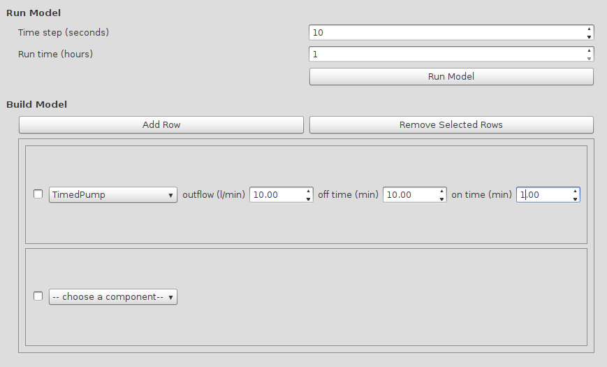
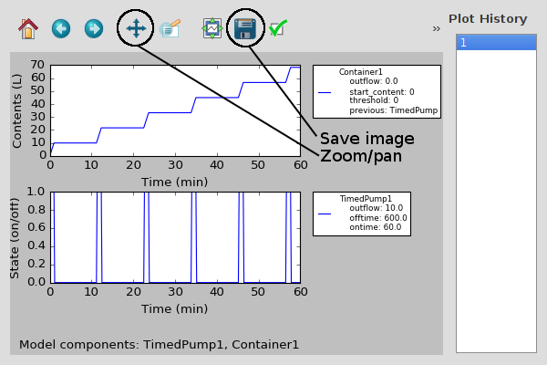

.. Aquaponics Modeler documentation master file, created by
   sphinx-quickstart on Sat Apr 23 16:19:26 2016.
   You can adapt this file completely to your liking, but it should at least
   contain the root `toctree` directive.

Welcome to Aquaponics Modeler's documentation!
==============================================

.. toctree::
   :maxdepth: 2

------------
Installation
------------
First you need to make sure you have PyQt5 installed. Unfortunately it's impossible to have it installed
as one of the regular dependencies, so you'll have to download it from https://www.riverbankcomputing.com/software/pyqt/download5.
If possible, download and install the binary version as that is the easiest.

Download the latest version of AquaponicsModeler from https://github.com/dolfandringa/AquaponicsModeler/archive/master.zip
and then run `pip install master.zip`. This will install the application and all other dependencies.

After installation you should be able to run aquaponicsmodeler(.exe) to run the application.

------------------
Building the model
------------------

In the modeler, rows of model components can be combined into a fully working
model. The rows of model components should be specified in the order in which
they are present in the actual setup. So for instance if a pump is pumping
water into a water tank, you need to have the :class:`Pump <model.Pump>` in the 
first row and the :class:`Container <model.Container>` in the second row.

When adding a row, you first need to choose the type of component for that row.
After you did, the parameters for that row need to be specified. If all rows
have been added and their parameters filled in, you can click the "Run Model"
button to get the resulting graphs showing the state of all components over
time.

^^^^^^^^^^
Components
^^^^^^^^^^

.. automodule:: AquaponicsModeler.model
    :noindex:
.. autoclass:: AquaponicsModeler.model.Container
    :noindex:
.. autoclass:: AquaponicsModeler.model.FloodDrainContainer
    :noindex:
.. autoclass:: AquaponicsModeler.model.Pump
    :noindex:
.. autoclass:: AquaponicsModeler.model.TimedPump
    :noindex:
.. autoclass:: AquaponicsModeler.model.Timed555Pump
    :noindex:

---------------
The Plot Window
---------------

After pressing the Run Model button, the plot window will show up with the resulting plots.
Currently there are only two groups of model components: Containers and Pump. Containers have L
as the state variable, which stores the current water content of the container. Pumps have the
on/off state of the pump in the state variable with 1=on and 0=off. These are the two variables
that are plotted in the plots.

To the right the plot history is shown, where you can see previous model runs including the model
parameters. You can also zoom and pan in the graph by clicking the tool and in the plot holding the
left mouse button while dragging for panning, and the right mouse button while dragging for zooming.
The image of the plots can be saved with the save button.

Indices and tables
==================

* :ref:`genindex`
* :ref:`modindex`
* :ref:`search`

